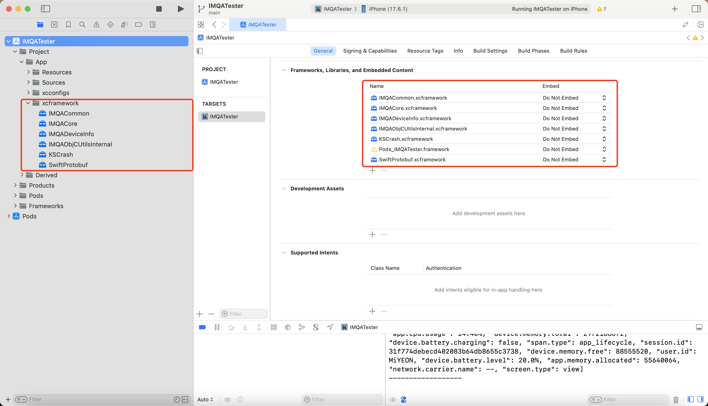

## 개요
IMQA iOS SDK는 iOS 애플리케이션을 위한 강력한 성능 모니터링 솔루션입니다. 이 문서는 설치 및 설정 방법에 대한 종합적인 가이드를 제공합니다.

## 필수 요구사항
- iOS 12.0 이상

## 설치 방법

### 방법 1: XCFramework 설치

1. **프로젝트에 XCFramework 추가**
   - IMQA iOS SDK XCFramework를 Xcode 프로젝트로 넣으세요
   - "Copy items if needed" 옵션 체크
   - 메인 타겟에 추가하세요




### 방법 2: CocoaPods 설치

1. **Podfile에 추가**
```ruby
use_frameworks!

target 'YourApp' do
  pod 'IMQACore'
end
```

2. **의존성 설치**
```bash
pod install
```

### 방법 3: Swift Package Manager 설치

**Package 주소**
```ruby
https://github.com/idlerecord/imqa-ios-sdk-spm
```

## API 소개및 설정

```Swift
@objc(IMQAOptions) public final class Options : NSObject {

        /// 서비스키
        /// web에서 서비스 추가시 받음
        public let serviceKey: String

        /// collector 주소setting
        /// 어느 collector로 data전송을 하는가
        public let endpoints: IMQA.Endpoints?

        /// sampling 하실때 sampling 비율(0.0~1.0)
        /// 0.0:수집되지 않습니다.
        /// 1.0: 100%수집됩니다.
        public var sampleRate: Double

        /// deviceID를 opentelemetry에 실려 collector로 전송여부
        /// deviceID: uuid를 생성하여 keychain에 저장한 값
        public var isDeviceIdEnable: Bool

        /// namespace 서비스공간
        /// web에서 서비스 추가시 받음
        public var namespace: String?

        /// sdk 수집여부를 api 돌려 받는 값에 결정
        public var sdkCollectControl: IMQA.SDKCollectControl?

        /// XHR 수집시 Request의 Header혹 Body를 수집여부setting
        ///  Setting하지 않을시 XHR은 수집하나 header와 body는 수집하지 않습니다.
        public var xhrOption: IMQA.XHROption?

        /// Webview에서 native가 보낸 data를 사용하나 webview자체에서 생성한
        /// data를 사용할것 인가
        /// Setting하지 않을시 native보낸 data를 사용
        /// native App에서 setting하지 않습니다.
        public var webviewOption: IMQA.WebviewOption?

        /// 운영계환경과 test환경이 한서버로 setting되여 있는 고객사가 있서
        /// 환경구분을 위한 setting값
        /// 각각 서버로 구성되는 고객사에서는 setting하지 않아도 됨
        public var deployEnvironment: IMQADeployEnvironment

        @objc public init(
            namespace: String? = nil, 
            serviceKey: String, 
            endpoints: IMQA.Endpoints? = nil, 
            deployEnvironment: IMQADeployEnvironment = .production, 
            sampleRate: Double = 1.0, 
            isDeviceIdEnable: Bool = true, 
            sdkCollectControl: IMQA.SDKCollectControl? = nil, 
            xhrOption: IMQA.XHROption? = nil, 
            webviewOption: IMQA.WebviewOption? = nil)
    }
```
```Swift
extension IMQA {

    /// sdk parameters setting fucntion
    /// - Parameter options: parameters
    /// - Returns: instance
    @discardableResult
    @objc public static func setup(options: IMQA.Options, 
    isDebug: Bool = false) -> IMQA?

    /// SDK시작
    @objc public func start()

    /// set userID
    /// - Parameter id: userID
    @objc public static func setUserId(id: String?)

    /// userID 회득
    /// - Returns: userID
    @objc public static func getUserId() -> String?

    /// custom log 찍기
    /// - Parameters:
    ///   - level: log level
    ///   - message: 메세지
    @objc public static func customLog(level: IMQA.LogLevel, 
    message: String)

    /// Span 데이터 전송시 함께 포함되는 값입니다.
    /// 형태: Dict["custom.key"] = value
    /// 예: key가 "hello", value가 "kitty"인 경우
    ///     Dict["custom.hello"] = "kitty"
    ///
    /// SDK start 이전에 설정하면 이후 생성되는 모든 Span에 자동으로 포함됩니다.
    /// SDK start 이후 설정하면 설정하는 시점이후 생성되는 모든 Span에 자동으로 포함됩니다.
    /// - Parameters:
    ///   - key: 키
    ///   - value: 값
    @objc public static func setAttribute(key:String, value: String?)

    ///1:) xib 로 webview layout시 주동으로 이 함수를 호출하세요.  
    ///    webview와 연동하는 script주입하는 방법입니다.
    ///2:) code로 initial시 호출하지 않아도 됩니다.
    /// 즉: 아래와 같은 code로 initial시
    ///  let configuration = WKWebViewConfiguration()
    ///  let view = WKWebView(frame: .zero, configuration: configuration)
    /// - Parameter userContentController: userContentController
    @objc public static func setWebviewConfiguration(
        userContentController: WKUserContentController)
}
```


### IMQA SDK 초기화 예제
#### Swift 프로젝트 초기화
```Swift
import UIKit
import IMQACore
@main
class AppDelegate: UIResponder, UIApplicationDelegate {

    var window: UIWindow?

    func application(_ application: UIApplication, 
        didFinishLaunchingWithOptions 
        launchOptions: [UIApplication.LaunchOptionsKey: Any]?) -> Bool {
        // Override point for customization after application launch.
        
        setupIMQASDK()

        return true
    }

    func setupIMQASDK() {
        let endpoint = IMQA.Endpoints(collectorURL: "collector 주소")
        let serviceKey = "서비스 키"
        // (Api 받아온 값으로 sdk수집여부)기능 사용여부
        let sdkControl = IMQA.SDKCollectControl(remoteCollectionControlEnable: true)
        // XHR option setting (HTTP Request Header, Body 수집여부)(XHR의 다른 값은 수집)
        let xhrOption = IMQA.XHROption(
            isCaptureHttpRequestHeader: true, 
            isCaptureHttpRequestBody: true)
        // Webview option setting (Native가 보낸 Data 사용여부)
        // true: Native가 보낸 Data 사용
        // false: Webview에서 생성한 Data 사용
        // default: true
        // Native App에서 setting하지 않습니다.
        let webOption = IMQA.WebviewOption(isSharedSession: true)

        //Sample Rate : 1.0 (0.0~1.0) 100% 수집
        //isDeviceIdEnable : true 기기ID활성화 여부
        //namespace : "namespace" 서비스 공간
        //deployEnvironment : .development 개발환경 setting
        let option = IMQA.Options(namespace: "namespace",
                                  serviceKey: serviceKey,
                                  endpoints: endpoint,
                                  deployEnvironment: .production,
                                  sampleRate: 1, 
                                  isDeviceIdEnable: true,
                                  sdkCollectControl: sdkControl,
                                  xhrOption: xhrOption,
                                  webviewOption: webOption
                                  )
        
        // SDK 초기화 및 시작
        //isDebug: true 디버그 모드 설정 (log 출력여부)
        IMQA
            .setup(options: option, isDebug: true)?
        .start()
    }
```

#### Objective-C 프로젝트 초기화
```objc
#import "AppDelegate.h"
#import <IMQACore/IMQACore-Swift.h>

@interface AppDelegate ()

@end

@implementation AppDelegate


- (BOOL)application:(UIApplication *)application
didFinishLaunchingWithOptions:(NSDictionary *)launchOptions {
    // Override point for customization after application launch.
    [self setupIMQASDK];
    return YES;
}

- (void)setupIMQASDK{
    IMQAEndpoints *endpoint = [[IMQAEndpoints alloc]
                               initWithCollectorURL:@"collecter 주소"];
    NSString * serviceKey = @"서비스 키";
    // (Api 받아온 값으로 sdk수집여부)기능 사용여부
    IMQASDKCollectControl *sdkControl = [[IMQASDKCollectControl alloc]
                                         initWithRemoteCollectionControlEnable:YES];
    
    // XHR option setting (HTTP Request Header, Body 수집여부)(XHR의 다른 값은 수집)
    IMQAXHROption *xhrOption = [[IMQAXHROption alloc]
                                initWithIsCaptureHttpRequestHeader:YES
                                isCaptureHttpRequestBody:YES];
    
    // Webview option setting (Native가 보낸 Data 사용여부)
    // true: Native가 보낸 Data 사용
    // false: Webview에서 생성한 Data 사용
    // default: true
    // Native App에서 setting하지 않습니다.
    IMQAWebviewOption * webOption = [[IMQAWebviewOption alloc]
                                     initWithIsSharedSession:YES];
    
    //Sample Rate : 1.0 (0.0~1.0) 100% 수집
    //isDeviceIdEnable : true 기기ID활성화 여부
    //namespace : "namespace" 서비스 공간
    //deployEnvironment : .development 개발환경 setting
    IMQAOptions *option = [[IMQAOptions alloc]
                           initWithNamespace:@"namespace"
                           serviceKey:serviceKey
                           endpoints:endpoint
                           deployEnvironment:IMQADeployEnvironmentProduction
                           sampleRate:1.0
                           isDeviceIdEnable:YES
                           sdkCollectControl:sdkControl
                           xhrOption:xhrOption
                           webviewOption:webOption];
    
    // SDK 초기화 및 시작
    //isDebug: true 디버그 모드 설정 (log 출력여부)
    [[IMQA setupWithOptions:option isDebug:YES] start];
    
}

```

## 웹뷰 페이지 세션 연결

네이티브 앱의 세션과 웹뷰 내 페이지 세션을 하나로 결합하기 위해 다음과 같이 setSharedSession() 설정과 WKWebView에 코드를 사용하여 WebView data를 연결해야 합니다.

<Gha keyword="TIP" title="하이브리드 앱(WebView 사용)에서의 IMQA 설정">
IMQA Android SDK, iOS SDK, WebAgent는 각각 환경의 특성에 맞는 데이터를 수집합니다. 
**iOS 앱의 웹뷰를 통해 웹 페이지가 호출되는 경우**, 하나의 사용자 세션으로 연결하고 WebView 데이터를 수집하려면 `WKWebViewConfiguration` 설정이 필요합니다.
</Gha>

Web에서 session을 공유할지 여부를 설정합니다. true로 설정하면 session을 공유하고 false이면 공유하지 않습니다. default는 ture입니다.

```swift
IMQA.setSharedSession(session: Bool)
```


WebView data 수집하려면 WKWebView에 javascript 를 추가해야 합니다. 두가지 방법이 있습니다.

### 1. WKWebView를 코드로 initialize할 경우
```swift
let config = WKWebViewConfiguration()        
// Hook 방법으로 web script 주입해드립니다. 
// 하여 따로 setting하지 않아도 됩니다.
let view = WKWebView(frame: .zero, configuration: config)
```

### 2. xib로 WKWebView를 initialize할 경우
```swift
let request = URLRequest(url: URL(string: "https://example.com/")!)
// xib로 layout한 webview를 IBOutlet으로 연결한 경우
// 아래와 같이 IMQA SDK와 webview를 연동하는 script주입하는 방법입니다.
IMQA.setWebviewConfiguration(
    userContentController: wkWebView.configuration.userContentController
)
wkWebView.load(request)
```

## Objective-C 프로젝트 통합

프로젝트가 오직 Objective-C로만 구성된 경우, Swift 코드 연동을 위해 아래 절차를 따라 주세요.

1. **`SwiftRuntimeLoader.swift` 파일을 생성합니다.**
2. **브리징 헤더를 생성할 것인지 묻는 창이 나타나면 "Don't create"를 선택합니다.**
3. **`SwiftRuntimeLoader.swift` 파일에 아래 내용을 추가합니다**

```swift
import Foundation
@objc class SwiftRuntimeLoader: NSObject {}
```

> 이 클래스는 Swift 런타임이 프로젝트에 로드되도록 보장하는 역할을 합니다.

4. **SwiftUI Render추적하려면 다음 코드를 추가해주세요.**

```swift
import IMQACore
    func scene(_ scene: UIScene, 
        willConnectTo session: UISceneSession, 
        options connectionOptions: UIScene.ConnectionOptions) {
        // Use this method to optionally configure and attach the UIWindow `window` to the provided UIWindowScene `scene`.
        // If using a storyboard, the `window` property will automatically be initialized and attached to the scene.
        // This delegate does not imply the connecting scene or session are new (see `application:configurationForConnectingSceneSession` instead).
        
        // Use a UIHostingController as window root view controller
        if let windowScene = scene as? UIWindowScene {
            let window = UIWindow(windowScene: windowScene)
            window.rootViewController = UIHostingController(rootView: 
            LandmarkList()
            .imqaTrackLifecycle(viewName: nil) // SwiftUI Render 추적
            .environmentObject(UserData()))
            self.window = window
            window.makeKeyAndVisible()
        }
    }
```

> 위 코드는 IMQA SDK를 Objective-C 프로젝트에 통합하고 초기화하는 기본 흐름을 보여줍니다.

## 모범 사례
1. SDK를 `AppDelegate`의 `didFinishLaunchingWithOptions`에서 초기화
2. 개발 및 프로덕션 환경에 맞는 URL 사용
3. 세션 추적을 위한 의미 있는 사용자 ID 설정
4. SDK 초기화 오류 모니터링

## 지원
추가 지원이나 질문이 있으시면 IMQA 지원팀에 문의해 주세요.

